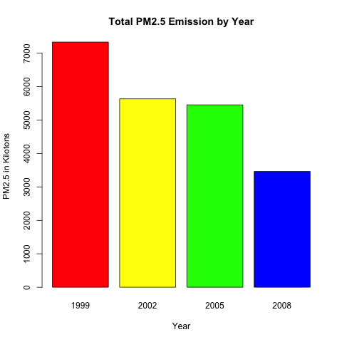
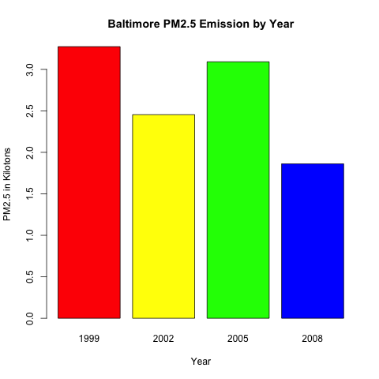
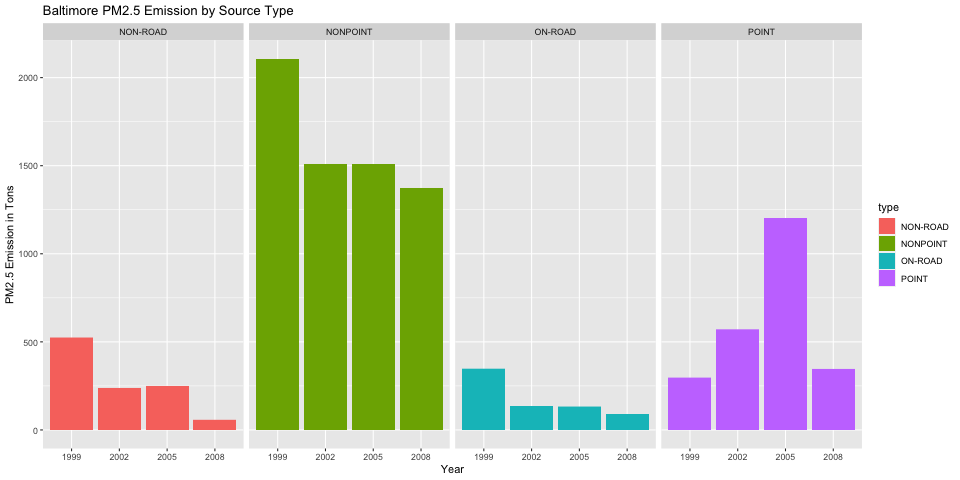
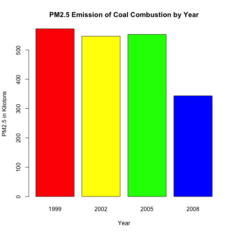
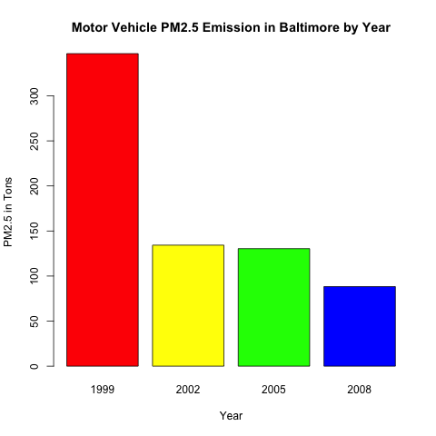
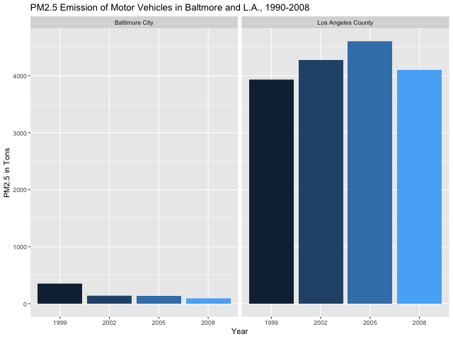

# README - Exploratory Data Analysis Course Project 2


## Purpose

The purpose of this project to explore the fine particulate matter (PM2.5) poluution in the United States in 1999, 2002, 2005 and 2008 by using the given datasets. 

Below questions are needed to answer:

1. Have total emissions from PM2.5 decreased in the United States from 1999 to 2008? Using the base plotting system, make a plot showing the total PM2.5 emission from all sources for each of the years 1999, 2002, 2005, and 2008.

2. Have total emissions from PM2.5 decreased in the Baltimore City, Maryland (fips == "24510") from 1999 to 2008? Use the base plotting system to make a plot answering this question.

3. Of the four types of sources indicated by the type (point, nonpoint, onroad, nonroad) variable, which of these four sources have seen decreases in emissions from 1999–2008 for Baltimore City? Which have seen increases in emissions from 1999–2008? Use the ggplot2 plotting system to make a plot answer this question.

4. Across the United States, how have emissions from coal combustion-related sources changed from 1999–2008?

5. How have emissions from motor vehicle sources changed from 1999–2008 in Baltimore City?

6. Compare emissions from motor vehicle sources in Baltimore City with emissions from motor vehicle sources in Los Angeles County, California (fips == "06037"). Which city has seen greater changes over time in motor vehicle emissions?

Datasets to be used are provided from the course website as shown below:

<https://d396qusza40orc.cloudfront.net/exdata%2Fdata%2FNEI_data.zip>

There are two datasets provided which are

- **summarySCC_PM25.rds**, contains a data frame with all of the PM2.5 emission data for 1999, 2002, 2005 and 2008. Corresponding fields are as shown below:

| Field     | Description                                             |
|:----------|:--------------------------------------------------------|
| fips      | A 5-digit number repsents U.S. county                   |
| SCC       | A digit string repsents source                          |
| Pollutant | A string indicating the pollutant                       |
| Emissions | Amount of PM2.5 emitted, in tons                        |
| type      | Type of sources (point, non-point, on-road, or non-road |
| year      | The year of emissions recorded                          |

- **Source_Classification_Code.rds**, provides a mapping from the **SCC** digit strings in the emission table to the actual name of the PM2.5 source.


## Data Preparation

Dataset will be downloaded and unzipped by *download.file* and *unzip* in the current directory as shown below:

```{r download_n_unzip}
data.url <- "https://d396qusza40orc.cloudfront.net/exdata%2Fdata%2FNEI_data.zip"
download.file(data.url, destfile = "./data/Dataset.zip", method = "curl")
unzip(zipfile = "./data/Dataset.zip", exdir = "./data")
```

Dataset will be retrieved by using *readRDS*. For example,

```{r read_files}
data.PM25 <- readRDS("./data/summarySCC_PM25.rds")
data.SCC <- readRDS("./data/Source_Classification_Code.rds")
```


## Question 1

The total PM2.5 emssion per year is aggregated as shown below: 

```{r aggregate_total_pm25}
emission.per.year <- aggregate(Emissions ~ year, data.PM25, FUN = sum)
```

Then, the graph will be plotted by base plotting system:

```{r plot_q1}
with(emission.per.year, 
     barplot(height = emission.per.year$Emissions/1000, 
             names.arg = emission.per.year$year, 
             xlab = "Year",
             ylab = "PM2.5 in Kilotons",
             main = "Total PM2.5 Emission by Year",
             col = bar.colors)
     )
```

The graph of Question 1 is as shown below:



**Therefore, total emissions from PM2.5 have decreased in the United States from 1999 to 2008.**


## Question 2

The PM2.5 emission of Baltimore will be extracted from original dataset and aggreate the total emission similar Question 1 by

```{r extract_baltimore}
data.baltimore <- data.PM25[data.PM25$fips=="24510",]
emission.per.year <- aggregate(Emissions ~ year, data.baltimore, FUN = sum)
```

Then, the graph will be plotted by base plotting system similar to Question 1:

```{r plot_q2}
with(emission.per.year, 
     barplot(height = emission.per.year$Emissions/1000, 
             names.arg = emission.per.year$year, 
             xlab = "Year",
             ylab = "PM2.5 in Kilotons",
             main = "Baltimore PM2.5 Emission by Year",
             col = bar.colors)
     )
```

The graph of Question 2 is as shown below:



**Therefore, total emissions from PM2.5 have decreased in the Baltimore City from 1999 to 2008.**


## Question 3

By using the dataset of Baltimore extracted in Question 2, we can use *facet_grid* from *ggplot2* to form a matrix of panels by source type (point, nonpoint, onroad, nonroad) variable as shown below:

```{r plot_q3}
library(ggplot2)
ggp <- ggplot(data = data.PM25.baltimore,
              aes(x = factor(year),
                  y = Emissions,
                  fill = type
                  )
              ) +
    geom_bar(stat = "identity") +
    facet_grid(. ~ type) +
    xlab("Year") +
    ylab("PM2.5 Emission in Tons") +
    ggtitle("Baltimore PM2.5 Emission by Source Type")
print(ggp)
```

The graph of Question 3 is as shown below:



**Therefore, only nonroad, nonpoint and onroad types have seen decreases in emission from 1999-2008 for Baltimore City.**


## Question 4

We first use *grepl* to extract **SCC** of Coal Combustion related records from Source Classification Code dataset and then aggreate the corresponding total emission of PM2.5 as follows:

```{r extract_n_aggregate_coal_combustion}
data.SCC.coal <- data.SCC[grepl("Fuel Comb.*Coal", data.SCC$EI.Sector), ]
emission.coal <- data.PM25[(data.PM25$SCC %in% data.SCC.coal$SCC), ]
emission.coal.per.year <- aggregate(Emissions ~ year, emission.coal, FUN = sum)
```

Then, the graph will be ploted as shown below:

```{r plot_q4}
ith(emission.coal.per.year, 
     barplot(height = emission.coal.per.year$Emissions/1000, 
             names.arg = emission.coal.per.year$year, 
             xlab = "Year",
             ylab = "PM2.5 in Kilotons",
             main = "PM2.5 Emission of Coal Combustion by Year",
             col = bar.colors
             )
     )
```

The graph of Question 4 is:



**Therefore, the emissions from coal combustion related sources have seen decreases from 1999-2008.**


## Question 5

It is assumed that the source type, **Onroad** represents the motor vehicles. Then, the **SCC** of the motor vehicles related records from the Source Classification Code dataset will be extracted and the corresponding emssions in Baltimore will be aggregated as follows:

```{r extract_n_aggreate_onroad}
data.SCC.vehicle <- data.SCC[data.SCC$Data.Category=="Onroad", ]
data.PM25.baltimore <- data.PM25[data.PM25$fips=="24510",]
emission.vehicle <- data.PM25.baltimore[(data.PM25.baltimore$SCC %in% data.SCC.vehicle$SCC), ]
emission.vehicle.per.year <- aggregate(Emissions ~ year, emission.vehicle, FUN = sum)
```

The graph will be ploted as below:

```{r plot_q5}
with(emission.vehicle.per.year, 
     barplot(height = emission.vehicle.per.year$Emissions, 
             names.arg = emission.vehicle.per.year$year, 
             xlab = "Year",
             ylab = "PM2.5 in Tons",
             main = "Motor Vehicle PM2.5 Emission in Baltimore by Year",
             col = bar.colors)
     )
```

The graph of Question 5 is:



**Therefore, the emissions from motor vehicles in Baltimore City have seen decreases from 1999-2008.**


## Question 6

Following Question 5, we will the extract the emission of Los Angeles as below:

```{r extract_la}
data.PM25.la <- data.PM25[data.PM25$fips=="06037",]
emission.vehicle.la <- data.PM25.la[(data.PM25.la$SCC %in% data.SCC.vehicle$SCC), ]
```

Then, an additional field **City** is added to both Baltimore and L.A. emission datasets and both both datasets are mergered into one for plotting: 

emission.vehicle.baltimore$City <- "Baltimore City"
emission.vehicle.la$City <- "Los Angeles County"```{r add_city}
emission.vehicle.combine <- rbind(emission.vehicle.baltimore, emission.vehicle.la)
```

The graph of the emission of motor vehicle in Baltimore and L.A. will be plotted as follows:

```{r plot_q6}
ggp <- ggplot(emission.vehicle.combine,
              aes(x = factor(year),
                  y = Emissions,
                  fill = City
                  )
              ) +
    geom_bar(aes(fill = year), stat = "identity") +
    facet_grid(scales = "free", space = "free", . ~ City) +
    guides(fill = FALSE) +
    ylab("PM2.5 in Tons") +
    xlab("Year") +
    ggtitle("PM2.5 Emission of Motor Vehicles in Baltmore and L.A., 1990-2008") 
print(ggp)
```

The graph of Question 6 is:



**Therefore, Baltimore City have seen greater changes over time in motor vehicle emissions.**
